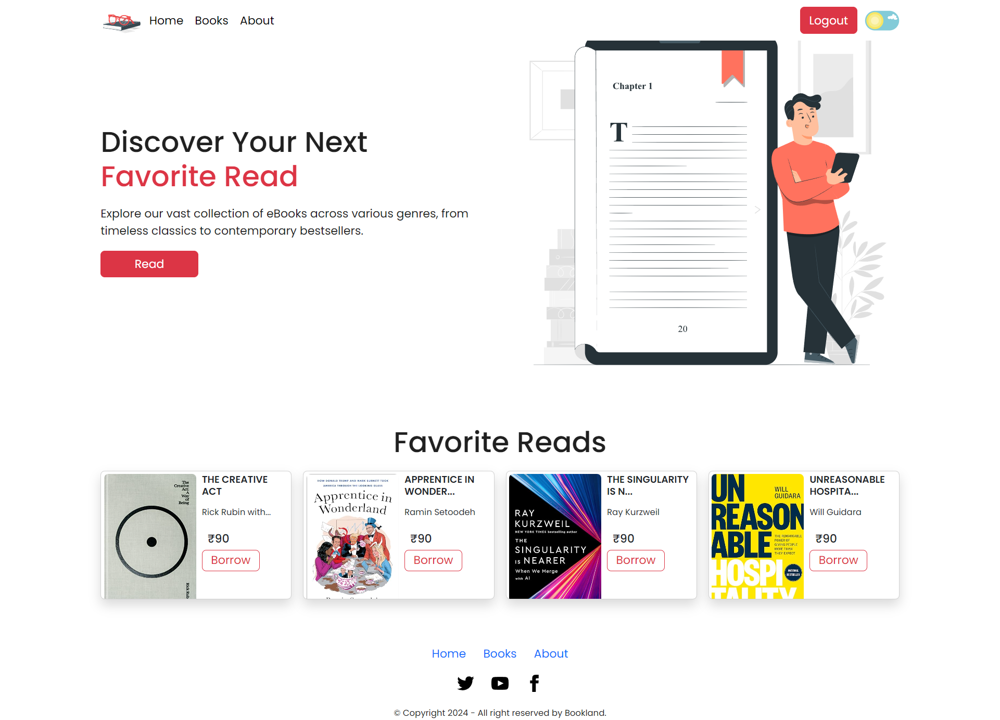

# e-Book Store Fullstack Project

## Overview
-----------

This is a fullstack project for an EBook store, built with , MongoDB, React, Expressjs, Node.JS, . The project allows users to browse, purchase, and download eBooks.

## Features
------------

* User authentication and authorization
* eBook catalog with search and filtering
* Add and checkout functionality
* Admin functionality 
* eBook management

## Getting Started
---------------

### Prerequisites (MERN)

* Node.js (for backend)
* React (for frontend)
* MongoDB (for database)
* Expressjs (for backend API and routing)
* Bootstrap5


### Installation

```bash
# Clone the repository
git clone https://github.com/username/ebook-store.git

# Install dependencies
cd ebook-store
npm install

# Start the backend server
cd backend
node server.js

# Start the frontend server
cd frontend
npm start
```
### Site View
-------------

